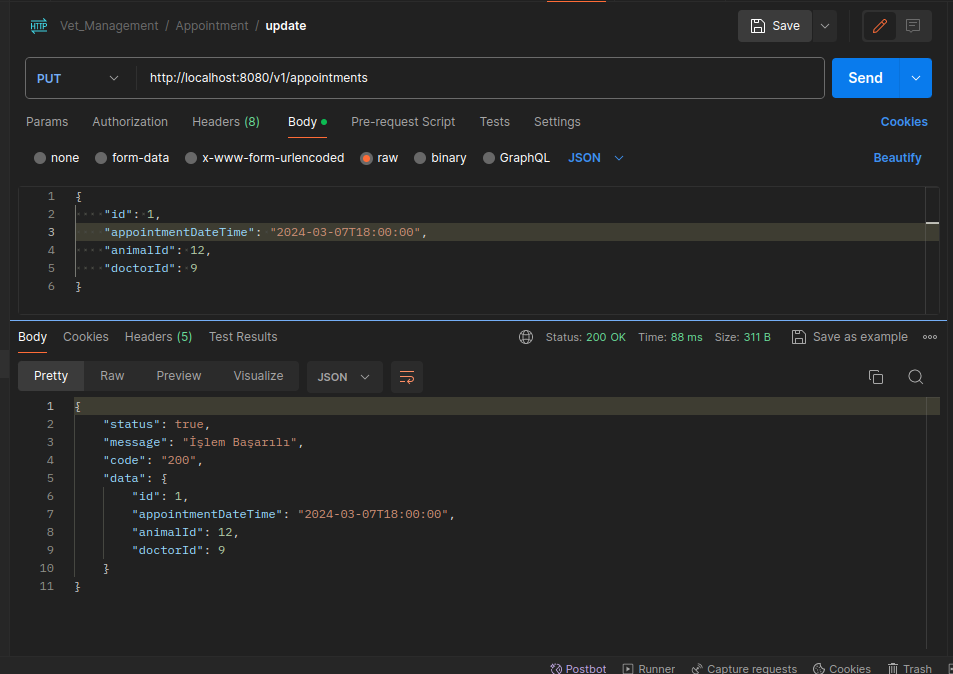
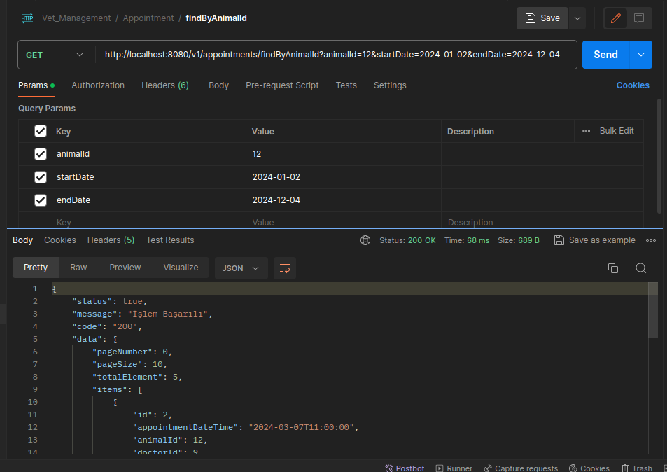
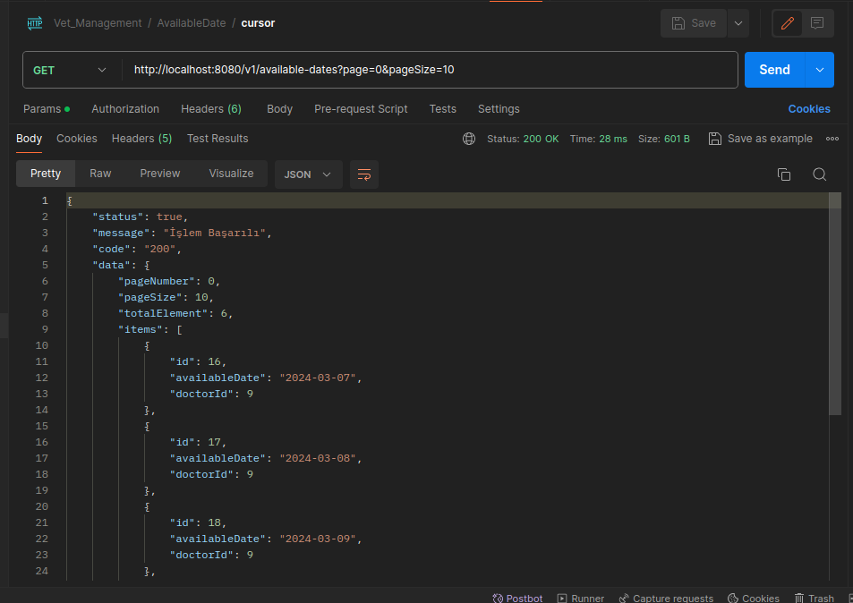

Veterinary Management System API.

This API is developed using Java Spring Boot.
Layered architecture is taken into account. 
It is a product of thinking and working on 
issues such as IoC (Inverse of Control), DI (Dependency Injection), 
annotations (@Entity, @Table, @Id, @OneToMany, @ManyToOne etc.), 
Http statuses, request and response transfers. .

Veterinary Management System Application.
Thanks to this application, an online veterinary management system can be built.
Thanks to the application, the user:
-Can record Veterinary doctors,
-Can record doctors' working days (available days),
-Can register customers,
-Can record customers' animals,
-Can record the vaccines applied to animals with their dates,
-Can make appointments with veterinarians for animals.

Images of the endpoints of the application are below.

###########################################################

Veteriner Yönetim Sistemi API.

Bu API, Java Spring Boot kullanılarak geliştirilmiştir.
Katmanlı mimari dikkate alınmıştır. IoC (Inverse of Control), 
DI (Dependency Injection), anotasyonlar (@Entity, @Table, @Id, @OneToMany, @ManyToOne gibi...), 
Http statüleri, request ve response aktarımları gibi konular üzerine 
düşünmenin ve çalışmanın bir ürünüdür.

Veteriner Yönetim Sistemi Uygulaması.
Bu uygulama sayesinde online veteriner yönetim sistemi kurulabilmektedir.
Uygulama sayesinde kullanıcı:
-Veteriner hekimleri kaydedebilir,
-Doktorların çalışma günlerini (mevcut günleri) kaydedebilir,
-Müşteri kaydı yapabilir,
-Müşterilerin hayvanlarını kaydedebilir,
-Hayvanlara uygulanan aşıları tarihleriyle birlikte kaydedebilir,
-Hayvanlar için veteriner hekimlerden randevu alabilir.

###########################################################

**-UML Diagram:**

**-Application description:**

**Animal Entity:**

-animal save:

-animal get:

-animal update:

-animal delete:

-find animal by animal name:

-find animal by owner id

-find all pageable:

**Customer Entity**

-customer save:

-customer get:

-customer update:

-customer delete:

-customer find by name:

-customer find all pageable:

**Doctor Entity**

-doctor save:

-doctor get:

-doctor update:

-doctor delete:

-doctor find all pageable:

**Appointment Entity**

-appointment save:

-appointment get:

-appointment update:

-appointment delete:

-appointment find all pageable:

-appointment find by animal id:

-appointment find by animal id and date between:

-appointment find by doctor id:

-appointment find by doctor id and date between:

**Available Date Entity:**

-available date save:

-available date get:

-available date update:

-available date delete:

-available date find all pageable:

**Vaccine Entity:**

-vaccine save:

-vaccine get:

-vaccine update:

-vaccine delete:

-vaccine find all pageable:

-vaccine find by animal id:

-vaccine find by animal id and date between:

-vaccine find by date between:
